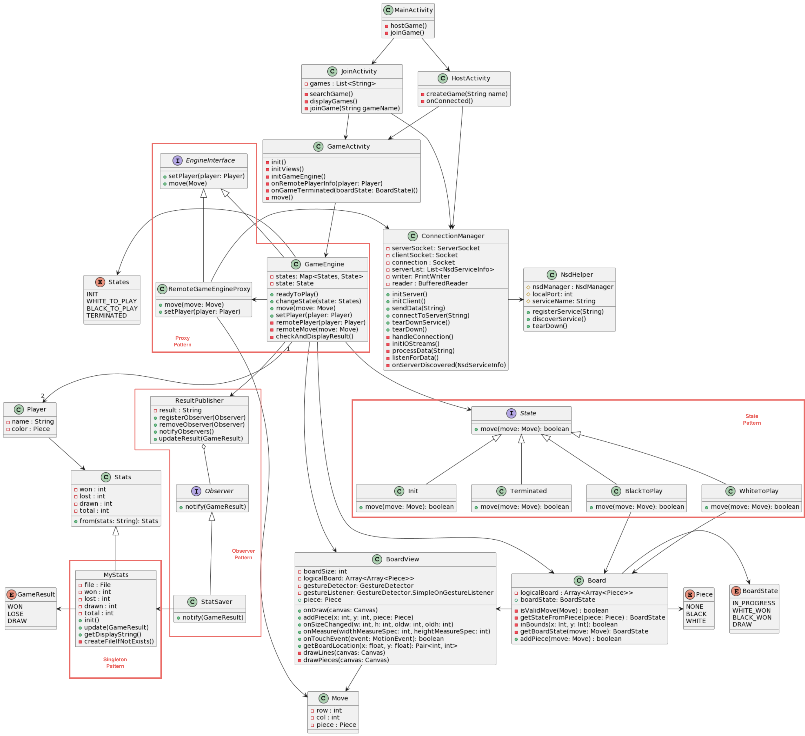

# Peer to Peer Two-Player Gomoku (Five in a row)

## Team Members

Aishwarya Paithankar <br/>
Varad Raut
<br/>

## Language Versions

Kotlin Version: 1.6.10 <br/>
Android: Android 9 (API level 28) Minimum

## Steps to run
First, clone this repository. If you have Android Studio installed on your machine, then just
import the project into Android Studio, connect your device (or emulator) and run the application.

If you don't have Android Studio, then you need at least JDK 1.8 (Java 8) installed on your machine
and in our PATH. Or your JAVA_HOME environment variable should be set to the JAVA installation directory. <br/>
Then, follow these steps:
1. In the project root directory, execute
   ```bash command
   ./gradlew build
   ./gradlew assemble
   ```
2. Connect your Android device (or emulator)
3. Execute
   ```shell
   ./gradlew installDebug
   ```
4. Open `GOMOKU` app on your device (or emulator)

<br/>

## Updated class diagram



## Notes & Assumptions

1. ### Identifying Patterns in code
   We have commented about the four patterns in code, all these comments start with `@Pattern`.
2. ### Identifying library usage in code
   We have commented about library usage in code, all these comments start with `@Library`.
